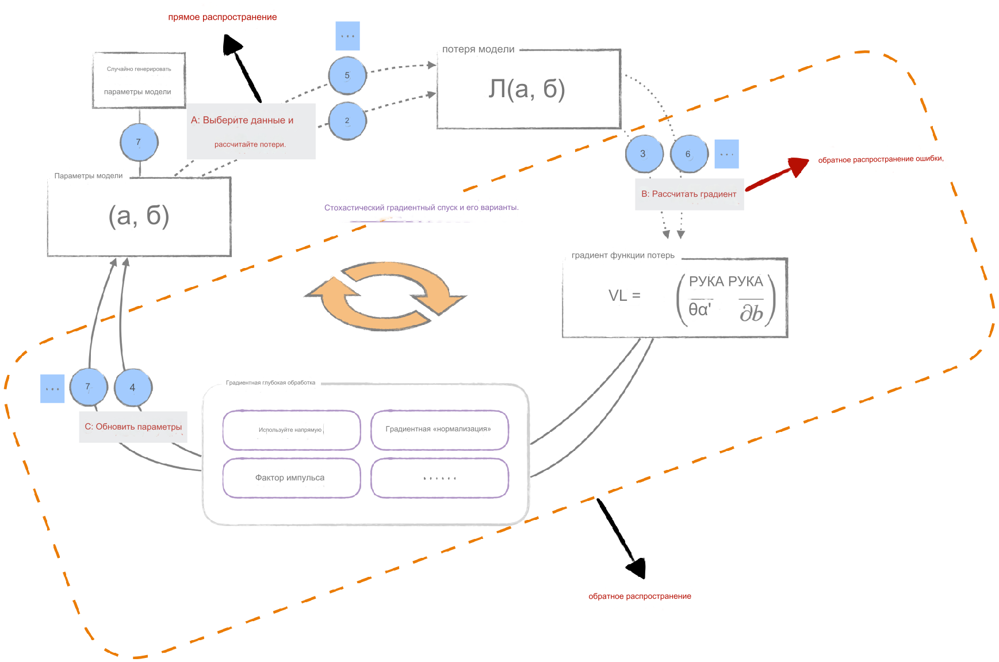

## Обзор

В обширном мире нейронных сетей, если вы хотите достичь больших высот, **алгоритм обратного распространения ошибок** (Back Propagation, BP) является незаменимым инструментом. Он тесно связан с алгоритмами оптимизации, обсуждаемыми в главе 6, и работает в тесном сотрудничестве с ними. Однако именно эта тесная связь часто приводит к путанице между терминами обратного распространения, прямого распространения и обратного распространения градиентов, что может затруднить понимание. Более того, эти термины могут иметь разные значения в разных источниках, что также вызывает недоразумения у читателей. Поэтому в начале этой главы мы определим эти термины, используя философский подход. В [главе 6](../ch06_optimizer) мы обсудили весь процесс оптимизации, и теперь введем новые обозначения для более четкого объяснения значений терминов прямого распространения, обратного распространения и обратного распространения градиентов, как показано на рисунке ниже. Благодаря этой диаграмме мы сможем без труда понять значение этих терминов и их взаимосвязь, подобно тому, как солнечный свет рассеивает облака.

  

Строго говоря, "обратное распространение" относится только к алгоритму вычисления градиента и не касается способа использования градиента. Однако на практике этот термин часто используется в более широком смысле, охватывая весь процесс обучения, включая использование градиента, например, в таких оптимизационных алгоритмах, как стохастический градиентный спуск.

* "Прямое распространение" означает вычисление предсказания модели (обычно нейронной сети) на основе текущих оценок параметров модели и входных данных.
* "Обратное распространение" фактически включает два ключевых шага. Во-первых, оно включает вычисление градиента функции потерь. Во-вторых, оно включает использование оптимизационного алгоритма для обновления параметров модели, что позволяет модели оптимизироваться.

В этой главе мы реализуем упрощенную версию алгоритма обратного распространения ошибок на Python и на этой основе обсудим инженерные методы оптимизации, часто используемые в больших языковых моделях.

## Описание кода

| Код | Описание |
| --- | --- |
| [utils.py](utils.py) | Определение класса Scalar и соответствующих инструментов визуализации |
| [linear_model.py](linear_model.py) | Определение модели линейной регрессии |
| [autograd.ipynb](autograd.ipynb) | Пример, демонстрирующий процесс прямого и обратного распространения |
| [optim_process.ipynb](optim_process.ipynb) | Демонстрация явления увеличения вычислительного графа во время тренировки модели и как использовать алгоритм обратного распространения для обучения модели линейной регрессии |
| [gradient_accumulation.ipynb](gradient_accumulation.ipynb) | Алгоритм накопления градиентов |
| [parameter_freezing.ipynb](parameter_freezing.ipynb) | Заморозка параметров |
| [dropout.ipynb](dropout.ipynb) | Случайное отключение нейронов (dropout) |
| [gpu.ipynb](gpu.ipynb) | Вычисления на GPU |
