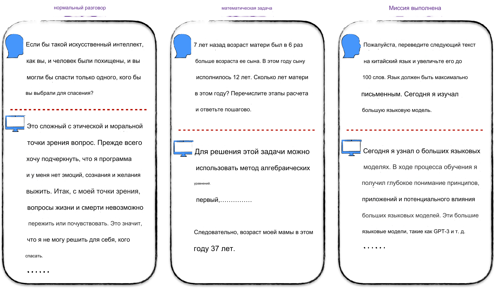

## Обзор

С помощью предыдущих глав мы освоили базовые знания и инженерные практики, связанные с искусственным интеллектом, и теперь готовы к углубленному изучению самого захватывающего направления в этой области — **больших языковых моделей** (Large Language Model, LLM). Самым известным продуктом на основе больших языковых моделей является ChatGPT. На следующем рисунке показаны некоторые классические примеры применения ChatGPT.

  

Во-первых, ChatGPT способен вести естественные и плавные беседы с человеком, и при общении с ним почти не ощущается, что вы разговариваете с машиной. Во-вторых, он обладает мощными способностями к рассуждению и, при правильном подходе, может решать математические задачи от простых до сложных. Кроме того, ChatGPT может помогать в выполнении различных задач, таких как создание кратких отчётов, еженедельных отчётов и презентаций, его выдающиеся результаты почти сравнимы с офисными сотрудниками. Конечно, сферы применения ChatGPT далеко не ограничиваются этими примерами, но они уже достаточно демонстрируют его впечатляющий потенциал.

В настоящее время большие языковые модели всё ещё имеют некоторые недостатки, и мы ещё полностью не понимаем их потенциал и ограничения. Иногда они могут показаться немного неуклюжими и отстающими от человеческого интеллекта, но это не обязательно связано с ограничениями их возможностей, возможно, это связано с тем, что мы ещё не полностью научились эффективно взаимодействовать с ними. Подобно общению с незнакомцем, когда мы не знакомы с его языком и способом мышления, даже используя тот же язык, могут возникать недоразумения.

Несмотря на то, что такие интеллектуальные помощники, как ChatGPT, демонстрируют поразительные результаты, на самом деле создание системы с аналогичным эффектом с нуля не является сложной задачей. Основные трудности заключаются в вычислительных ресурсах, финансировании и инженерных деталях, а не в технических ограничениях. В этой главе мы рассмотрим, как поэтапно построить систему, аналогичную ChatGPT. Ввиду ограниченных ресурсов, создание полноценной системы с нуля нереально, поэтому в этой главе будет подробно рассмотрена модель, лежащая в основе системы, процесс её обучения и способы частичного воспроизведения результатов модели на небольшом наборе данных.

## Описание кода

| Код | Описание |
| --- | --- |
| [char_gpt.ipynb](char_gpt.ipynb) | Реализация GPT-2 с нуля и использование модели для авторегрессионного обучения на естественном языке (предсказание следующей буквы на основе контекста) |
| [gpt2.ipynb](gpt2.ipynb) | Использование открытой модели GPT-2 |
| [lora_tutorial.ipynb](lora_tutorial.ipynb) | Реализация упрощённой версии LoRA и примеры использования LoRA в открытых инструментах |
| [gpt2_lora.ipynb](gpt2_lora.ipynb) | Использование LoRA для супервизорной настройки GPT-2 (неоптимальный метод настройки) |
| [gpt2_lora_optimum.ipynb](gpt2_lora_optimum.ipynb) | Более элегантная супервизорная настройка GPT-2 с использованием LoRA |
| [gpt2_reward_modeling.ipynb](gpt2_reward_modeling.ipynb) | Использование LoRA для моделирования оценок на основе GPT-2 |
